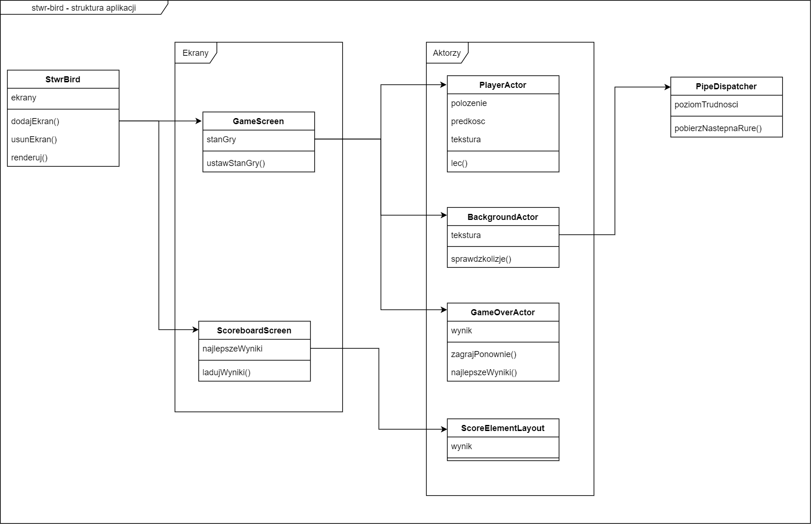

# stwr-bird - Dokumentacja

Niniejszy dokument zawiera dokumentację gry stwr-bird.

## Opis gry

Gra jest klonem popularnej gry *Flappy Bird*. Oprócz funkcjonalności obecnej w pierwowzorze zawiera także
dodatkowe elementy opisane w dalszej części dokumentu. Gra polega na sterowaniu tytułowym ptakiem tak, aby przelatywał
przez przeszkody nie dotykając ich. Sterowanie polega na stukaniu w ekran. Każde kliknięcie dodaje ptakowi chwilowy
odrzut w górę, dzięki czemu nie spadnie on na ziemię. Trzeba stukać w odpowiednich momentach, aby ptak znalazł się
na właściwej wysokości pozwalającej na przelecenie przez przeszkodę.

Gra wykorzystuje system punktacji. Za przelecenie przez jedną przeszkodę gracz dostaje jeden punkt. Gry z największą
punktacją zapisywane są na tablicy najlepszych wyników.

### Technologia wykorzystana przy tworzeniu gry

* Android SDK (wersja API 29)
* Android Studio
* Biblioteka [libGDX](https://libgdx.badlogicgames.com/)

### Funkcjonalność

* Sterowanie postacią w celu omijania przeszków
* Liczenie punktów za omijanie przeszkód i zapisywanie najlepszych wyników
* Możliwość grania jedną z dwóch grywalnych postaci
* Rosnący poziom trudności (różne typy przeszków)

## Opis elementów interfejsu

#### Menu główne 

Pierwszy ekran wyświetlany po uruchomieniu aplikacji. W prawym górnym rogu znajduje się przycisk pozwalający na
wybór postaci. Kliknięcie w dowolne inne miejsce rozpoczyna grę. 


#### Ekran gry

Tutaj odbywa się właściwa rozgrywka. W centrum góry ekranu znajduje się licznik zdobytych to tej pory punktów.


#### Ekran końca gry

Ten ekran jest wyświetlany po zakończeniu gry. Prezentowane są uzyskane punkty. Po kliknięciu przycisku zielonej
strałki można ponownie rozpocząć grę. Po kliknięciu przycisku podium wyświetlana jest tablica najlepszych wyników.


## Kompilacja projektu

Po sklonowaniu projektu można go otworzyć w Androi Studio. Jednak w razie potrzeby plik *apk* można wygenerować bez
uruchamiania środowiska W tym celu należy uruchomić poniższe polecenia:

**Windows:**

```
gradlew.bat texturePacker assembleDebug
```

**Linux:**

```shell script
chmod +x gradlew
./gradlew taxturePacker assembleDebug
```

Po zakończeniu procesu budowania plik binarny gry znajzuje się w katalogu
`android/build/outputs/apk/debug`. Jeżeli na komputerze jest zainstalowany pakiet *ADB*, grę
można zainstalować na urządzeniu z Androidem za pomocą poniższego polecenia:

```
adb install android/build/outputs/apk/debug/android-debug.apk
``` 

## Opis techniczny

Ta sekcja zawiera opis gry od strony technicznej.

### Struktura gry

Gra jest podzielona na ekrany. Każdy ekran zawiera pewną liczbę aktorów, czyli elementy posiadające pewne właściwości
(np. rozmiar, położenie, obrót) i mogące być narysowane na ekranie. Aktorzy zawierają logikę odpowiedzialną
za funkcjonowanie gry.

Poniżej zostały przedstawione i opisane najważniejsze klasy projektu.

* `StwrBird` - Główna klasa i punkt startowy gry. Zawiera kod odpowiedzialny za zarządzanie zdefiniowanymi ekranami.
* `GameScreen` - Ekran przedstawiający scenerię właściwej gry. Koordynuje wyświetlanie aktorów odpowiedzialnych
za różne etapy rozgrywki (menu główne, gra w toku, koniec gry). 
* `ScoreboardScreen` - Ekran przedstawiający najlepsze wyniki. Odpowiaada za załadowanie najlepszych wyników z danych
aplikacji oraz wyświetlenie ich w liście za pomocą aktorów.
* `PlayerActor` - Przedstawia postać gracza. Reaguje na zdarzenia dotknięcia ekranu w celu aktualizacji prędkości
w osi pionowej. Włącza jedną z dostepnych tekstur postaci, w zależności od bieżących ustawień gry.
* `BackgroundActor` - Rysuje tło gry, podłoże oraz przeszkody. Zawiera logikę wykrywającą kolizję z graczem.
* `GameOverActor` - Wyświetlany po uderzeniu gracza w przeszkodę, wyświetla informacje o wyniku.
* `ScoreElementLayout` - Przedstawia element listy najlepszych wyników.
* `PipeDispatcher` - Klasa przypominająca swoją funkcjonalnością kolejkę. Generuje w locie parametry kolejnych
przeszkód do umieszczenia na ekranie przed graczem. Parametryzacja jest pobierania z definicji poziomów trudności.
 

